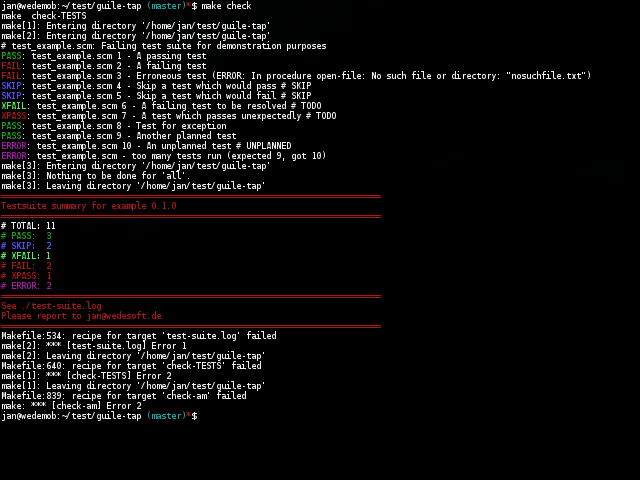

# guile-tap example

**guile-tap.scm** is a simple drop-in library for unit-testing programs developed with [GNU Guile](http://www.gnu.org/software/guile/). It implements the [Test Anything Protocol (TAP)](https://testanything.org/).

You can try out the example test script using **guile-tap.scm** as follows:

```Shell
guile -L . test_example.scm
```

You can try out Automake TAP support like this:

```Shell
make -f Makefile.dist
./configure
make check
```

It will give some errors to demonstrate the behaviour of the test script.



## External links

* [wedesoft/guile-tap](https://github.com/wedesoft/guile-tap/)
* [xevz/guile-tap](https://github.com/xevz/guile-tap/)
